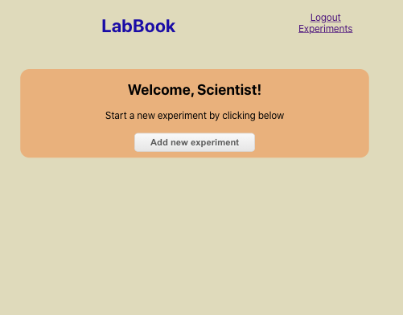

# Lab Book App

Open [live app](https://lab-book.vercel.app/) to view it in the browser.

This project was bootstrapped with [Create React App](https://github.com/facebook/create-react-app).

## Description 
This is a feature of a larger app that will help field researchers track their research and store their field observations.

The form layout is based on the scientific method. Users will use the app to sign up, document, and delete multiple experiment observations.

## Technology Stack
This client-side app was made using the React library with JavaScript, CSS 3 and HTML 5. 

## Mobile Screenshots

### Landing Page

### Registration Page

### Login Page

### Login Validation Error

### New User View

### Returning/Existing User View

### New Experiment Page

### Experiment with Observations

### New Observation Page

### Observation Page

